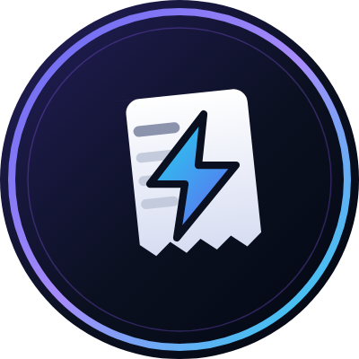

<div align="center">



# PaySlip

### Payroll at the speed of a block.

**Pay your whole team in ETH on Botchain. Seconds, not days.**

[](https://docs.Botchain.com/chain/)
[](https://nextjs.org)
[](https://vercel.com)
[](#license)

</div>


---

## The problem

International payroll is still built on 1970s plumbing. A salary leaves the employer on Monday and lands on Thursday — if the corridor is a good one. Along the way it picks up wire fees, an FX spread nobody quotes up front, and a compliance hold that nobody can explain. The employee gets a PDF that proves nothing. The employer gets a bank statement that proves nothing either.

Meanwhile the money exists as a number in a database the whole time.

## What PaySlip does

PaySlip moves payroll onto [Botchain](https://docs.Botchain.com/chain/) — an Arbitrum Orbit L2 that settles to Ethereum. An employer connects a wallet, imports their team, and runs payroll. Every employee is paid in native ETH, directly to their own wallet, and every payment leaves a permanent record on a public ledger.

No bank hours. No correspondent chain. No "it's pending."

**For employers**
- Import a team once, run payroll on a schedule or on demand
- One dashboard for balances, history, and per-employee status
- Every run produces a per-employee result — you always know exactly which payments landed
- Branded PDF payslips generated automatically

**For employees**
- Paid to a wallet you control — non-custodial, always
- A block explorer link as your receipt, permanent and independently verifiable
- Full payment history, read straight from chain
- No account with a bank you didn't choose

## How it works

```
Employer wallet  ──▶  PaySlip  ──▶  Botchain  ──▶  Employee wallets
                                          │
                                          └──▶  Explorer = permanent receipt
```

1. **Connect** — any injected EVM wallet (MetaMask, Rabby, …). PaySlip prompts to add and switch to Botchain on first connect.
2. **Import your team** — names, roles, salaries, wallet addresses.
3. **Run payroll** — review the batch, confirm, and each employee is paid in native ETH.
4. **Receipts** — every payment carries a memo in its calldata, permanently attached to the transfer and readable from the explorer.

Payroll runs settle as one transaction per employee, so each payment is independent — one failure never rolls back the payments that already landed, and the UI reports exactly which is which. Payment history is read from the Blockscout indexer rather than the RPC, since native ETH transfers emit no logs for `eth_getLogs` to find.

## Network

|  | Testnet (default) | Mainnet |
|---|---|---|
| Chain ID | `46630` | `4663` |
| RPC | `https://rpc.testnet.chain.Botchain.com` | `https://rpc.mainnet.chain.Botchain.com` |
| Explorer | https://explorer.testnet.chain.Botchain.com | https://Botchainchain.blockscout.com |
| Gas token | ETH | ETH |
| Faucet | https://faucet.testnet.chain.Botchain.com | — |

Switch with `NEXT_PUBLIC_CHAIN_ENV` (`testnet` or `mainnet`). Chain definitions live in [src/lib/chains.ts](src/lib/chains.ts); every chain call goes through [src/lib/chain.ts](src/lib/chain.ts).

## Screenshots

Real captures of the running app, at 2x DPI.

|  |  |
|---|---|
|  |  |
| **Landing** | **Payroll sent — on-chain receipt** |

<details>
<summary>More screenshots</summary>

### Pricing


### Sign in


### Mobile


</details>

> Employer dashboard, payroll run, and employee portal captures are still to be taken —
> those routes need an authenticated session and a connected wallet.

## Run it yourself

**You'll need:** Node.js 18+, a MongoDB database, an EVM wallet extension, and testnet ETH from the [faucet](https://faucet.testnet.chain.Botchain.com).

```bash
git clone https://github.com/payslip-robin/payslip.git
cd payslip
npm install
cp .env.example .env.local   # add your MongoDB + NextAuth values
npm run dev
```

Open http://localhost:3000. The Botchain defaults need no API keys — only your database and auth secret. On first wallet connect the app will prompt you to add and switch to Botchain Testnet.

## Built with

**Next.js 14** (App Router) · **TypeScript** · **viem** for chain I/O · **Tailwind** + **shadcn/ui** · **NextAuth** · **MongoDB** · **Blockscout** for indexed history

## Roadmap

- [ ] Stablecoin payouts (USDC) alongside native ETH
- [ ] Recurring scheduled payroll runs
- [ ] Batch contract to settle a full run in a single transaction
- [ ] Employer-side CSV import and accounting export

## License

[MIT](./LICENSE)
